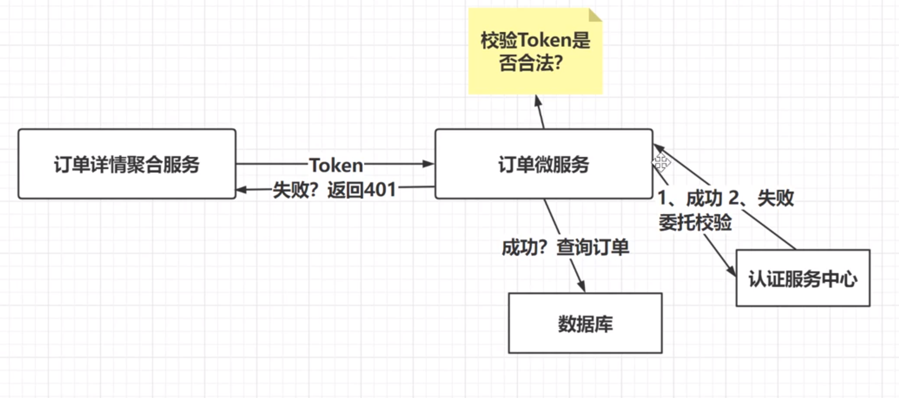

## 目录
[[toc]]

## 分布式权限核心概念
**什么是权限**  
权限：就是一个字符串   
服务端限制客户端能够做什么事情。  

**什么是分布式权限**   
我们由一个地方统一管理权限的权限就叫分布式管理权限。  

就是分布式系统中多个节点通信时，对各请求的身份验证。然后这些各个节点身份验证，我们单独提出一个节点（微服务）来做统一的验证，从而降低了维护成本，提高效率。
核心就是统一管理各节点的请求验证，并采用AOP模式实现分布式系统的权限，来确保系统的安全。   

    


## 分布式权限应用

分布式权限主要应用在微服务系统中，各节点通信请求身份验证。

    

## 分布式权限-权限微服务创建 
条件   
1、电商微服务系统   
2、LKN.AuthMicroService  

步骤     
1、权限微服务创建   
   采用abp CLI 指令创建DDD权限微服务项目
   ``` bash
    abp new LKN.AuthMicroService -t module --dbms mysql -no-ui  -o  moduls\LKN.AuthMicroService -v 7.3.0
   ```  
    


2、权限微服务导入    

 权限微服务导入项目中

    

3、权限微服务集成IdentityServer4（作用：帮助所有微服务实现权限校验）   

abp已经封装好IdentityServer4,只需对应模块引用即可。

    

4、权限微服务迁移IdentityServer4对应的表。     
   abpCLI默认生成的 `LKN.AuthMicroService.HttpApi.Host` 的数据库是Sqlserver, 我们需要自己添加mysql   
   nuget 引用 `Volo.Abp.EntityFrameworkCore.MySQL`,修改 `AuthMicroServiceHttpApiHostModule` 类 DependsOn中添加mysql依赖注入 ，并修改相应的配置。   

   项目中集成abp  IdentityServerEntittyFrameworkCore, 需要在项目EF模块中找到`AuthMicoServiceEntityFrameworkCoreModule.cs`文件 ，并在DepensOn依赖注入“`AbpIdentityServerEntityFrameworkCoreModule`”

    

   EntityFrameworkCore 目录下，找到 `AuthMicroServiceDbContextModelCreatingExtensions` 添加 id4表  
   
    

   让在AuthMicoServiceDbContext 类，实现abp接口`IIdentityServerDbContext` ,这里可以从源中copy

    
    
   如果不想使用abp的EF上下文本对象类，也可以替换AuthMicroServiceDBContext

    
   
   去掉IdentityServer4前缀
 
    

   1、生成迁移文件    
   打开项目目录使用cmd,dotnet ef 生成迁移文件
   ``` bash
   dotnet ef migrations add authmicroservices
  
   ```
   2、执行迁移文件，生成了权限服务表   
   ``` bash
    dotnet ef database update
   ```
    

5、落地权限微服务，创建表对应的接口   

1、ApiScope:API作用域，具体的每一个微服务   
2、ApiResource:微服务API资源，微服务每一个接口     
    增删改查接口

3、Client:客户端，访问微服务一端   
4、IdentityResource:身份资源，用户身份权限管理   
5、PersistedGrant:配置表，持续化认证，认证类型  
   oicd auth2 jwt code   
6、DeviceFlowCodes: 配置表，设备码，作用不大。  


## 分布式权限-IdentityServer4集成  
项目`LKN.AuthMicroService.HttpApi.Host` 中 AuthMircoServiceHttpApiHostModule 类中 OnApplicationInitialization 方法 ，添加  app.UseIdentityServer(); // 增加IdentityServer4


EF  Volo.Abp.Identity.EntityFrameworkCore

## 分布式权限微服务落地

## 单点登录
## 分布式权限校验
## 全微服务校验

 



1、api作用域   

