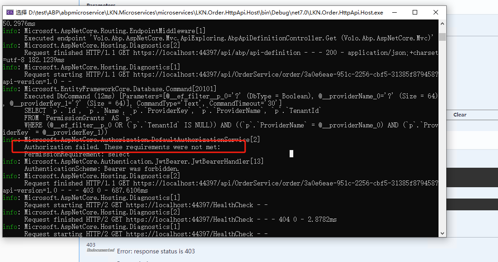

## 目录
[[toc]]

## 分布式权限核心概念
**什么是权限**  
权限：就是一个字符串   
服务端限制客户端能够做什么事情。  

**什么是分布式权限**   
我们由一个地方统一管理权限的权限就叫分布式管理权限。  

就是分布式系统中多个节点通信时，对各请求的身份验证。然后这些各个节点身份验证，我们单独提出一个节点（微服务）来做统一的验证，从而降低了维护成本，提高效率。
核心就是统一管理各节点的请求验证，并采用AOP模式实现分布式系统的权限，来确保系统的安全。   

    


## 分布式权限应用

分布式权限主要应用在微服务系统中，各节点通信请求身份验证。

    

## 分布式权限-权限微服务创建 
条件   
1、电商微服务系统   
2、LKN.AuthMicroService  

步骤     
1、权限微服务创建   
   采用abp CLI 指令创建DDD权限微服务项目
   ``` bash
    abp new LKN.AuthMicroService -t module --dbms mysql -no-ui  -o  moduls\LKN.AuthMicroService -v 7.3.0
   ```  
    


2、权限微服务导入    

 权限微服务导入项目中

    

3、权限微服务集成IdentityServer4（作用：帮助所有微服务实现权限校验）   

abp已经封装好IdentityServer4,只需对应模块引用即可。

    

4、权限微服务迁移IdentityServer4对应的表。     
   abpCLI默认生成的 `LKN.AuthMicroService.HttpApi.Host` 的数据库是Sqlserver, 我们需要自己添加mysql   
   nuget 引用 `Volo.Abp.EntityFrameworkCore.MySQL`,修改 `AuthMicroServiceHttpApiHostModule` 类 DependsOn中添加mysql依赖注入 ，并修改相应的配置。   

   项目中集成abp  IdentityServerEntittyFrameworkCore, 需要在项目EF模块中找到`AuthMicoServiceEntityFrameworkCoreModule.cs`文件 ，并在DepensOn依赖注入“`AbpIdentityServerEntityFrameworkCoreModule`”

    

   EntityFrameworkCore 目录下，找到 `AuthMicroServiceDbContextModelCreatingExtensions` 添加 id4表  
   
    

   让在AuthMicoServiceDbContext 类，实现abp接口`IIdentityServerDbContext` ,这里可以从源中copy

    
    
   如果不想使用abp的EF上下文本对象类，也可以替换AuthMicroServiceDBContext

    
   
   去掉IdentityServer4前缀
 
    

   1、生成迁移文件    
   打开项目目录使用cmd,dotnet ef 生成迁移文件
   ``` bash
   dotnet ef migrations add authmicroservices
  
   ```
   2、执行迁移文件，生成了权限服务表   
   ``` bash
    dotnet ef database update
   ```
    

5、落地权限微服务，创建表对应的接口   

1、ApiScope:API作用域，具体的每一个微服务   
2、ApiResource:微服务API资源，微服务每一个接口     
    增删改查接口

3、Client:客户端，访问微服务一端   
4、IdentityResource:身份资源，用户身份权限管理   
5、PersistedGrant:配置表，持续化认证，认证类型  
   oicd auth2 jwt code   
6、DeviceFlowCodes: 配置表，设备码，作用不大。  


## 分布式权限-IdentityServer4集成  

项目模块`LKN.AuthMicroService.Domain`、 `LKN.AuthMicroService.Domain.Shared`、`LKN.AuthMicroService.EntityFrameworkCore` 集成 IdentityServer4 ，使用nuget修改包之后,分别在Module文件中依赖注册id4的module文件。

  

1、`LKN.AuthMicroService.Domain`中的`AuthMicroServiceDomainModule` 文件添加 ` typeof(AbpIdentityServerDomainModule)`

``` c# 
[DependsOn(
    typeof(AbpDddDomainModule),
    typeof(AuthMicroServiceDomainSharedModule),
    typeof(AbpIdentityServerDomainModule)
)]
public class AuthMicroServiceDomainModule : AbpModule
{

}
```

2、`LKN.AuthMicroService.Domain.Shared`中的 `AuthMicroServiceDomainSharedModule` 添加 `typeof(AbpIdentityServerDomainSharedModule)`  

``` c# 
[DependsOn(
    typeof(AbpValidationModule),
    typeof(AbpDddDomainSharedModule),
    typeof(AbpIdentityServerDomainSharedModule)
)]
public class AuthMicroServiceDomainSharedModule : AbpModule
{
```

3、`LKN.AuthMicroService.EntityFrameworkCore`中的 `AbpIdentityServerEntityFrameworkCoreModule` 添加 ` typeof(AbpIdentityServerEntityFrameworkCoreModule)`

``` c#
[DependsOn(
    typeof(AuthMicroServiceDomainModule),
    typeof(AbpEntityFrameworkCoreModule),
    typeof(AbpIdentityServerEntityFrameworkCoreModule)// 集成
)]
public class AuthMicroServiceEntityFrameworkCoreModule : AbpModule
{
    public override void ConfigureServices(ServiceConfigurationContext context)
    {
        context.Services.AddAbpDbContext<AuthMicroServiceDbContext>(options =>
        {
                /* Add custom repositories here. Example:
                 * options.AddRepository<Question, EfCoreQuestionRepository>();
                 */
        });
    }
}

```

## 分布式权限微服务落地

分布式权限微服务项目已经创建成功，并且集成了identiytserver4,现在我们根据自己的需求实现`ApiResources`的添加服务。

    

IdentityServer4 EFCore 上下文对象的`IIdentityServerDbContext`设置，之前我们在自己的`AuthMicroServiceDbContext`类，已经继承`IIdentityServerDbContext`接口，并已经实现，
但是运行调用接口时:
1、报错异常：  

  

1.1、解决方式在`appsettings.json`  添加 数据库连接`AbpIdentityServer`。
 
  

为什么是这个名称呢，需要查看源码。

  
  

1.2、解决方式基于原有数据库连接字符串，可以`AuthMicroServiceDbContext`添加特替换`IIdentityServerDbContext`

``` c#
[ConnectionStringName(AuthMicroServiceDbProperties.ConnectionStringName)]
[ReplaceDbContext(typeof(IIdentityServerDbContext))] // 替换IIdentityServerDbContext
public class AuthMicroServiceDbContext : AbpDbContext<AuthMicroServiceDbContext>, IAuthMicroServiceDbContext, IIdentityServerDbContext
{
   ....
}
```
2、异常
调用接口时，发现数据库表名称不存在，仔细观察发现多个前缀`IdentityServer`
  

解决方式去掉`IdentityServer`的前缀，我们需要在`LKN.AuthMicroService.HttpApi.Host`模块中，找到`AuthMicroServiceHttpApiHostModule`文件，并在`ConfigureServices` 添加 `AbpIdentityServerDbProperties.DbTablePrefix = "";`  即可

  

修改以问题，调用接口执行成功   

  


## 分布式权限AuthMicoService落地

检查IdentityServer4是否可以成功访问`https://localhost:44386/.well-known/openid-configuration`
                                  

  

不能访问，表示配置没有成功。

1、需要引用身份模块`identity`集成到项目中： `Volo.Abp.Identity.EntityFrameworkCore`、`Volo.Abp.Identity.Application.Contracts`   
可以按模块引用，也可以单独在`LKN.AuthMicroService.HttpApi.Host`模块项目引用（也可以通过nuget包添加）。  

``` c# 
	  <PackageReference Include="Volo.Abp.Identity.EntityFrameworkCore" Version="7.3.0" />
	  <PackageReference Include="Volo.Abp.Identity.Application.Contracts" Version="7.3.0" />
	  <PackageReference Include=" Volo.Abp.PermissionManagement.Domain.Identity" Version="7.3.0" />
```
在`AuthMicroServiceHttpApiHostModule` 依赖注入 `typeof(AbpIdentityEntityFrameworkCoreModule)`,    `typeof(AbpIdentityApplicationContractsModule)`,`  typeof(AbpPermissionManagementDomainIdentityModule)`
``` c#
[DependsOn(
 ....
    typeof(AbpIdentityEntityFrameworkCoreModule),
    typeof(AbpIdentityApplicationContractsModule),
    typeof(AbpPermissionManagementDomainIdentityModule),
  ....
    )]
public class AuthMicroServiceHttpApiHostModule : AbpModule
{
   ...
}
```
2、需要引用账号模块`account`集成到项目中,主要功能登录、注册、退出，集成项目`Volo.Abp.Account.Web.IdentityServer` 、`Volo.Abp.Account.Application`
 在`LKN.AuthMicroService.HttpApi.Host`模块项目引用（也可以通过nuget包添加）
 ```c#
 	  <PackageReference Include="Volo.Abp.Account.Web.IdentityServer" Version="7.3.0" />
	  <PackageReference Include="Volo.Abp.Account.Application" Version="7.3.0" />
 ```
在`AuthMicroServiceHttpApiHostModule` 依赖注入 `typeof(AbpAccountWebIdentityServerModule)`,    `typeof(AbpAccountApplicationModule)`
``` c#
[DependsOn(
 ....
    typeof(AbpAccountWebIdentityServerModule),
    typeof(AbpAccountApplicationModule),
  ....
    )]
public class AuthMicroServiceHttpApiHostModule : AbpModule
{
   ...
}
```
注意：`AuthMicroServiceHttpApiHostModule` 中需要添加 `app.UseIdentityServer()`,`app.UseAuthentication()`,` app.UseAuthorization()` 否则启动 identityServer4会失败。  

``` c#
 
    public override void OnApplicationInitialization(ApplicationInitializationContext context)
    {
        var app = context.GetApplicationBuilder();
        var env = context.GetEnvironment();

        if (env.IsDevelopment())
        {
            app.UseDeveloperExceptionPage();
        }
        else
        {
            app.UseHsts();
        }

        app.UseHttpsRedirection();
        app.UseCorrelationId();
        app.UseStaticFiles();
        app.UseRouting();
        app.UseCors();
        app.UseAuthentication();
        //if (MultiTenancyConsts.IsEnabled)
        //{
        //    app.UseMultiTenancy();
        //}
        //app.UseAbpRequestLocalization();
        app.UseIdentityServer(); // 增加IdentityServer4
        app.UseAuthorization();
        app.UseSwagger();
        app.UseAbpSwaggerUI(options =>
        {
            options.SwaggerEndpoint("/swagger/v1/swagger.json", "Support APP API");

            var configuration = context.GetConfiguration();
            options.OAuthClientId(configuration["AuthServer:SwaggerClientId"]);
            options.OAuthScopes("AuthMicroService");
        });
        app.UseAuditing();
        app.UseAbpSerilogEnrichers();
        app.UseConfiguredEndpoints();
    }

```
``` bash
 启用identityserver4成功   https://localhost:44386/.well-known/openid-configuration
```
  

返回 json 数据的目的是什么

1、作用，如何使用
``` json
{
   //接口
    "issuer":"https://localhost:44386",
    "jwks_uri":"https://localhost:44386/.well-known/openid-configuration/jwks",
    "authorization_endpoint":"https://localhost:44386/connect/authorize",
    "token_endpoint":"https://localhost:44386/connect/token",
    "userinfo_endpoint":"https://localhost:44386/connect/userinfo",
    "end_session_endpoint":"https://localhost:44386/connect/endsession",
    "check_session_iframe":"https://localhost:44386/connect/checksession",
    "revocation_endpoint":"https://localhost:44386/connect/revocation",
    "introspection_endpoint":"https://localhost:44386/connect/introspect",
    "device_authorization_endpoint":"https://localhost:44386/connect/deviceauthorization",
    "frontchannel_logout_supported":true,
    "frontchannel_logout_session_supported":true,
    "backchannel_logout_supported":true,
    "backchannel_logout_session_supported":true,
    //作用域
    "scopes_supported":[
        "offline_access"
    ],
    "claims_supported":[

    ],
    //认证类型
    "grant_types_supported":[
        "authorization_code",
        "client_credentials",
        "refresh_token",
        "implicit",
        "password",
        "urn:ietf:params:oauth:grant-type:device_code"
    ],
    //响应值
    "response_types_supported":[
        "code",
        "token",
        "id_token",
        "id_token token",
        "code id_token",
        "code token",
        "code id_token token"
    ],
    "response_modes_supported":[
        "form_post",
        "query",
        "fragment"
    ],
    "token_endpoint_auth_methods_supported":[
        "client_secret_basic",
        "client_secret_post"
    ],
    //加密算法
    "id_token_signing_alg_values_supported":[
        "RS256"
    ],
    "subject_types_supported":[
        "public"
    ],
    "code_challenge_methods_supported":[
        "plain",
        "S256"
    ],
    "request_parameter_supported":true
}
```

## 分布式权限AuthMicoService应用
1、业务场景：查询订单详细的业务，需要3个微服务，一个订单聚合微服务，另一个是订单微服务，还有一个商品微服务。
目前情况微服务之前请求没有身份验证，任何一个人都可以访问，这给我们的微服务系统带来了风险了，如果是黑客攻击，那么导致服务宕机，影响使用。  
我们为了防止被攻击，当服务请求时做一个验证，验证当时的请求是否合法，以保证微服务系统的安全。

怎么添加验证呢   
如：订单微服务，我们只需在`LKN.Order.HttpApi` 模块层，找到订单控制器，在对应的查询订单方法上添加一个特性`[Authorize]`，同时，开启身份认证,在`OrderHttpApiHostModule`中 `OnApplicationInitialization`里添加`app.UseAuthentication(); // 1、开启身份权限`,` app.UseAuthorization(); // 2、开始身份授权`.   

调用时会返回401,没有权限

     

如何把请求转发给AuthMircoServer权限验证呢？  

我们需要在OrderService微服务，添加IdentityServer4 中的账号验证 ，通过nuget引用包 `IdentityServer4.AccessTokenValidation`（对版本有要求，net5是可以这配置没有问题，net6\net7就要问题了）。
在`OrderHttpApiHostModule` 中配置
```c# 
 public override void ConfigureServices(ServiceConfigurationContext context)
 {
       .....   
          // 2、认证中心身份认证
      context.Services.AddAuthentication("Bearer")
               .AddIdentityServerAuthentication(options =>
               {
                  options.Authority = "https://localhost:44386"; // 1、认证中心地址
                  options.ApiName = "OrderService"; // 2、api名称(项目具体名称)
                  options.RequireHttpsMetadata = false; // 3、https元数据，不需要
               });
      ...
 }

```
联调时异常信息   

     

解决方案如下，就可以了。[解决参考地址](https://qa.1r1g.com/sf/ask/4898505461/)  / [解决方案](https://stackoverflow.com/questions/69978649/migration-to-net6)
``` c#
  context.Services.AddAuthentication(options => {
                options.DefaultAuthenticateScheme = JwtBearerDefaults.AuthenticationScheme;
                options.DefaultChallengeScheme = JwtBearerDefaults.AuthenticationScheme;
            })
            .AddJwtBearer(options =>
            {
                options.Authority = configuration["AuthServer:Authority"]; //
                options.RequireHttpsMetadata = Convert.ToBoolean(configuration["AuthServer:RequireHttpsMetadata"]);
                options.Audience = "OrderService";
            });
```
读取配置appsetting.json
``` json
 "AuthServer": {
    "Authority": "https://localhost:44386/",
    "RequireHttpsMetadata": "false",
    "SwaggerClientId": "Order_Swagger",
    "SwaggerClientSecret": "1q2w3e*"
  },
```

## 总结：用户实现登录之后，会得到一个什么结果？
 身份证

Authorze :本质上就是校验身份证。   

身份证：token(令牌)  

1、订单详情聚合服务得到一个身份证token.
## Token如何得到呢？   
1、AuthMicroServer得到一个Token    
 AuthMicroServer根据什么得到？   
 1、根据订单详情聚合服务信息。

 ## AuthMicroServer认证中心配置
 1、需要分布式认证中心，添加客户信息 Client 相当注册用户


     

``` json
{
  "clientName": "OrderDetailsServices-Client",  //订单详细聚合服务
  "secret": "12345", //密码
  "redirectUri": "string",
  "postLogoutRedirectUri": "string",
  "scopes": [
    "OrderService" //作用域  订单微服务,相当于授权
  ],
  "grantTypes": [
    "client_credentials"  //认证类型 client认证  
  ]
}
```

2、创建token,先在`LKN.OrderDetailService` 订单详细聚合服务项目，引用abp架构中` Volo.Abp.Http.Client.IdentityModel`包（nuget） ,或者项目引用

``` c#
<PackageReference Include="Volo.Abp.Http.Client.IdentityModel" Version="7.3.0" />
```  

在 `OrderDetailsServicesModule` 类中依赖注入 
``` c#
 [DependsOn(typeof(AbpHttpClientIdentityModelModule))]// 配置AbpIdentityModel
```

并在`OrderDetailsController`类中的采用属性依赖注入获取`IIdentityModelAuthenticationService`实例,作用是生成identityService
``` c#
 /// <summary>
    /// 订单详情控制器
    /// </summary>
    [ApiController]
    [Route("api/OrderDetailsServices/OrderDetails")]
    public class OrderDetailsController : ControllerBase
    {
        //属性依赖注入
        public IIdentityModelAuthenticationService _authenticationService { get; set; }
    ....
    }

```

3、获取订单详情聚合微服务身份证（token）  
```C# 
       /// <summary>
        ///  获取订单详情聚合服务身份证(Token)
        /// </summary>
        /// <param name="id"></param>
        /// <returns></returns>
        [HttpGet("GetToken")]
        public string GetToken()
        {
            IdentityClientConfiguration identityClient = new IdentityClientConfiguration();
            identityClient.Authority = "https://localhost:44386";
            identityClient.ClientId = "OrderDetailsServices-Client";
            identityClient.ClientSecret = "12345";
            identityClient.GrantType = "client_credentials";
            return _authenticator.GetAccessTokenAsync(identityClient).Result;
        }
```

当我们调用GetToken方法获取接口时报错

     

 apiSopes API作用域没有注册'微服务数据'，查看数据库`ApiScopes`表为空

     

这个时候我们通过api的`ApiScope`接口，添加微服务数据

``` json
{
  "name": "OrderService",
  "displayName": "OrderService1"
}
```

执行后查看数据库表

   

AuthMircoService微服务日志显示获取token成功  

     

OrderDetailsService 微服务，调用获取token接口,并成功生成了token  

     

## 总结 token生成思路  
1、先注册订单微服务
2、然后注册订单详情客户信息
3、然后生成订单详情客户的身份证

## 用token 访问接口
 token获取成功，根据订单id,查询订单详情聚合接口，报错异常  

     

ApiResource 中没有注册订单微服务资源，我们需要在AuthMicroServer微服务接口，添加“OrderService”
``` json
{
  "name": "OrderService",
  "displayName": "OrderService1",
  "description": "OrderService",
  "claims": [
    "admin"
  ]
}
```

     

即可添加

     

### 总结认证中心的思路


## 分布式权限-自定义策略权限   
根据订单详情聚合微服务的订单查询业务，我们已经对订单微服务进行了身份验证，同时也创建了AuthMicroServive认证中心，也把权限认证做在AuthMicroServive微服务（这样做是不合理，应该做到各自的微服务中进行管理并授权），现在我们需要调整这块授权移到订单微服务中，自己的授权自己服务管理。

步骤  
1、OrderService 对应领域集成 abp  PermissionManagement 服务 源码进行集成。并在 Module类中添加相对应的依赖注入特性。 
``` c# 
  // LKN.Order.Domain
 <PackageReference Include="Volo.Abp.PermissionManagement.Domain" Version="7.3.0" />
 <PackageReference Include="Volo.Abp.PermissionManagement.Domain.IdentityServer" Version="7.3.0" />
 <PackageReference Include="Volo.Abp.PermissionManagement.Domain.Identity" Version="7.3.0" />
 // LKN.Order.Domain.Shared
 
 <PackageReference Include="Volo.Abp.PermissionManagement.Domain.Shared" Version="7.3.0" />
 <PackageReference Include="Volo.Abp.Identity.Domain.Shared" Version="7.3.0" />

 // LKN.Order.EntityFrameworkCore
 <PackageReference Include="Volo.Abp.PermissionManagement.EntityFrameworkCore" Version="7.3.0" />
 <PackageReference Include="Volo.Abp.Identity.EntityFrameworkCore" Version="7.3.0" />

```
2、OrederService微服务 OrderDomainModule、OrderDomainSharedModule,OrderEntityFrameworkCoreModule 添加特性

OrderDomainModule添加  typeof(AbpPermissionManagementDomainModule)，typeof(AbpPermissionManagementDomainIdentityModule)， typeof(AbpPermissionManagementDomainIdentityServerModule) 特性
``` c#
using Volo.Abp.Domain;
using Volo.Abp.Modularity;
using Volo.Abp.PermissionManagement;
using Volo.Abp.PermissionManagement.Identity;
using Volo.Abp.PermissionManagement.IdentityServer;

namespace LKN.Order;
[DependsOn(
    typeof(AbpDddDomainModule),
    typeof(OrderDomainSharedModule),
    typeof(AbpPermissionManagementDomainModule),
    typeof(AbpPermissionManagementDomainIdentityModule),
    typeof(AbpPermissionManagementDomainIdentityServerModule)
)]
public class OrderDomainModule : AbpModule
{

}
```
如果缺少 `Volo.Abp.PermissionManagement.Domain.Identity` 引用会报以下错误  

      

OrderDomainSharedModule 添加  typeof(AbpPermissionManagementDomainSharedModule)
``` c# 
namespace LKN.Order;
[DependsOn(
   ...
    typeof(AbpPermissionManagementDomainSharedModule)
)]
public class OrderDomainSharedModule : AbpModule
{
    public override void ConfigureServices(ServiceConfigurationContext context)
    {
        ....
    }
}

``` 

OrderEntityFrameworkCoreModule 添加  typeof(AbpPermissionManagementEntityFrameworkCoreModule) 特性

``` c# 
 using Microsoft.Extensions.DependencyInjection;
using Volo.Abp.EntityFrameworkCore;
using Volo.Abp.EntityFrameworkCore.MySQL;
using Volo.Abp.Modularity;
using Volo.Abp.PermissionManagement.EntityFrameworkCore;

namespace LKN.Order.EntityFrameworkCore;

[DependsOn(
    typeof(OrderDomainModule),
    typeof(AbpEntityFrameworkCoreMySQLModule),
    typeof(AbpPermissionManagementEntityFrameworkCoreModule),
    typeof(AbpEntityFrameworkCoreModule)
)]
public class OrderEntityFrameworkCoreModule : AbpModule
{
    public override void ConfigureServices(ServiceConfigurationContext context)
    {
        context.Services.AddAbpDbContext<OrderDbContext>(options =>
        {
                /* Add custom repositories here. Example:
                 * options.AddRepository<Question, EfCoreQuestionRepository>();
                 */
        });
    }
}

```


3、实现权限服务应用层 OrderServicePermissionsAppService类、IOrderServicePermissionsAppService接口 

      

OrderServicePermissionsAppService  实现
```c# 
using LKN.Order.Orders;
using System;
using System.Collections.Generic;
using System.Linq;
using System.Text;
using System.Threading.Tasks;
using Volo.Abp.Application.Dtos;
using Volo.Abp.Authorization.Permissions;
using Volo.Abp.PermissionManagement;

namespace LKN.Order.Permissions
{
    public class OrderServicePermissionsAppService : OrderAppService, IOrderServicePermissionsAppService
    {
        private readonly IPermissionManager _permissionManager;

        public OrderServicePermissionsAppService(IPermissionManager permissionManager)
        {
            _permissionManager = permissionManager;
        }


        public async Task AddRolePermissionAsync(string roleName, string permission)
        {
            await _permissionManager.SetAsync(permission, RolePermissionValueProvider.ProviderName, roleName, true);
        }

        public async Task AddUserPermissionAsync(Guid userId, string permission)
        {
            await _permissionManager.SetAsync(permission, UserPermissionValueProvider.ProviderName, userId.ToString(), true);
        }
        public async Task AddClientPermissionAsync(string ClientName, string permission)
        {
            await _permissionManager.SetAsync(permission, ClientPermissionValueProvider.ProviderName, ClientName, true);
        }
    }
}

```
IOrderServicePermissionsAppService 定义接口

```c#
  /// <summary>
    /// 授权接口
    /// </summary>
    public interface IOrderServicePermissionsAppService
    {
        public Task AddRolePermissionAsync(string roleName, string permission);

        public Task AddUserPermissionAsync(Guid userId, string permission);

        public Task AddClientPermissionAsync(string ClientName, string permission);
    }
```
OrderPermissionDefinitionProvider 添加权限类型
``` c# 
using LKN.Order.Localization;
using Volo.Abp.Authorization.Permissions;
using Volo.Abp.Localization;

namespace LKN.Order.Permissions;

public class OrderPermissionDefinitionProvider : PermissionDefinitionProvider
{
    public override void Define(IPermissionDefinitionContext context)
    {
        //var myGroup = context.AddGroup(OrderPermissions.GroupName, L("Permission:Order"));
        var myGroup = context.AddGroup(OrderPermissions.GroupName);

        var permissionDefinition = myGroup.AddPermission(OrderPermissions.Orders.Default);
        permissionDefinition.AddChild(OrderPermissions.Orders.Update);
        permissionDefinition.AddChild(OrderPermissions.Orders.Create);
        permissionDefinition.AddChild(OrderPermissions.Orders.Delete);
        permissionDefinition.AddChild(OrderPermissions.Orders.Select);

        permissionDefinition.AddChild("select");
    }

    private static LocalizableString L(string name)
    {
        return LocalizableString.Create<OrderResource>(name);
    }
}
```




## 分布式权限-动态C#客户端权限  

## 分布式权限-分布式登录   
## 分布式权限-其他微服务权限  
## 分布式权限-网关权限  


## 查询添加一个Select权限   
1、定义权限    
   1.1、给接口授权      
2、添加客户权限     
   2.1、生成迁移文件     
   2.2、创建权限表      
3、创建权限添加接口      
4、校验分两步完成     
   4.1 先校验是否登录，Authorize（认证）     
        委托：AuthMicroService     
   4.2 然后校验权限 select(鉴权)     
        委托：OrderService     
        abp:Volo.Abp.Authorization   

## 总结：   
1、认证中心     
2、订单微服务身份证    
3、订单微服务权限校验   
4、C#动态Client 权限校验    
5、场景  


## 单点登录

## 分布式权限校验