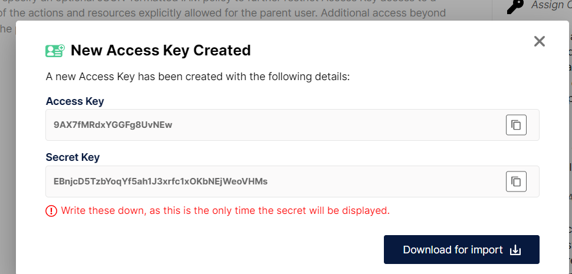

## 目录

[[toc]]

## 分布式文件系统中间件-Minio  

### 什么是Minio 
Minio是分布式文件系统。指：文件可以存储在多个主机中
如图所示：

   

文件：**图片，视频，音频**等等   
主机：linux 、 windows 、 mac 等等   
图片可以存储到多个linux,或者多个windows,或者从个Mac 
换句话说：Minio就是OSS。对象存储系统。对象代表的是任何文件都可以存储。一般，目前主流的云平台，基本使用的都是OSS存储文件方式。Minio中存储最大文件可以达到5TB。任何类型的文件都是支持的。   

### 什么地方使用Minio   

Minio主要使用在微服务中。单体系统中，图片资源是比较少的，所以，没有必要使用分布文件系统。   

### 微服务系统中为什么要使用Minio  

微服务系统有很多，包含电商微服务系统，包含OA微服务系统，以及其他不同微服务系统。主要通过电商微服务系统进行举例说明为什么要使用Minio?   
先得到一个电商微服务系统。如何得到？电商微服务系统是由单体电商系统而来    

#### 单体电商系统  

搜索商品实现过程，客户端发起查询请求——>电商系统——>电商数据库。    

如果客户端有这一个要求，查询订单时候，需要查询出商品。如何实现这个规则要求呢？   

查询订单实现过程，客户端发武查询请求——>电商系统——>电商数据库——>订单表和商品表进行关联。  

当时，如果电商系统并发量、业务量、数据量全部上升之后，单体系统查询，添加、修改、删除性能会急剧下降。进一步甚至会导致系统宕机（宕机也就无法访问），如果系统出现了宕机问题，直接导致系统无法访问。   

在允许电商系统并发量、业务量、数据量上升的情况下，如何提升系统性能，防止系统宕机呢？  
方案：需要进行系统业务模块拆分   
结果：形成电商微服务系统   
#### 电商微服务系统  

  

在微服务电商系统中，我们主要看一个业务场景，搜索商品业务场景。   

搜索商品实现过程，客户端发起查询请求——>电商系统——>电商数据库。   

如果客户端有这样一个要求，查询订单的时候，需要搜索出商品。如何实现这个规则要求呢？  
查询订单实现过程，客户端发起查询请求——>电商网站——>订单微服务——>电商数据库。  
电商网站——>商品微服务——>电商数据库。   
一次订单查询需要涉及到2个微服务（订单微服务，商品微服务）查询。
如果并发量比较大，会导致2个微服务查询性能下降。因为是同步请求，同步请求并发处理有限   
如果两个微服务其中一个微服务宕机了，会导致无法进行查询。   
如何提升系统性能和防止系统宕机呢？  
方案：使用Minio  

#### 电商微服务系统-上传图片   

  


#### 电商微服务系统-电商网站拆分  

  


#### 电商微服务系统-Minio  

   

在微服务电商系统中，我们主要看一个业务场景，搜索商品业务场景。   
搜索商品实现过程，客户端发起查询请求——>电商系统——>商品微服务——>电商数据库。  
如果客户端有这样一个要求，查询订单的时候，需要查询出商品。如何实现这个规则要求呢？  
查询订单实现过程，客户端发起查询请求——>电商网站——>Minio。   
在Minio中可以一次性查询出订单商品数据。而且还可以提升性能   
总结：这就是我们在电商系统中使用Minio原因    
1、先从单体电商系统分析   
2、然后再从电商微服务系统分析  
3、最后引入 Minio   
4、由此得到微服务系统为什么要使用Minio  

### 微服务中如何落地Minio  
 前提  
 1、电商微服务系统  
 2、Minio  
 3、mc  
 步骤  
 1、电商微服务系统准备  
 通过vs2022创建Net7电商微服务系统    
   

 2、Minio准备  
  
 下载地址：https://dl.min.io/server/minio/release/windows-amd64/minio.exe   
 [windows-amd64/minio.exe 下载](https://dl.min.io/server/minio/release/windows-amd64/minio.exe)    

​ 如图所示  

   

3、mc准备  
下载地址：https://dl.min.io/client/mc/release/windows-amd64/mc.exe

​ 如图所示  

   

#### 上传商品图片业务场景落地  

条件  
1、电商微服务系统LKN.EBusiness   
2、Minio  
3、客户端  
步骤   
1、先进行电商微服务系统LKN.EBusiness 
1.1 在项目中通过nuget引入Minio  

  

1.2、先在商品网站中创建ProductController类

  

然后再ProductController类添加代码  

```C# 
using Microsoft.AspNetCore.Http;
using Microsoft.AspNetCore.Mvc;
using Minio;

namespace LKN.EBusiness.Controllers
{
    /// <summary>
    /// 商品图片控制器
    /// </summary>
    [ApiController]
    [Route("[controller]")]
    public class ProductFileController : ControllerBase
    {

        private readonly ILogger<ProductFileController> _logger;

        public ProductFileController(ILogger<ProductFileController> logger)
        {
            _logger = logger;
        }

        /// <summary>
        /// 文件上传
        /// </summary>
        /// <returns></returns>
        [HttpPost("Upload")]
        public IActionResult Upload(IFormFile formFile)
        {
            // 2.1 创建MinioClient客户端
            MinioClient minioClient = new MinioClient("127.0.0.1:9000", "minioadmin", "minioadmin");

            // 2.2 创建文件桶
            if (!minioClient.BucketExistsAsync("product").Result)
            {
                minioClient.MakeBucketAsync("product").Wait();
            }

            // 2.3 上传文件
            minioClient.PutObjectAsync("product", formFile.FileName, formFile.OpenReadStream(), formFile.Length).Wait();

            _logger.LogInformation($"文件:{formFile.FileName}上传到MinIO成功");

            return new JsonResult("上传成功");
        }
    }
}

```
2、Minio准备
2.1 先进入到Minio目录

  

2.2、然后使用cmd启动Minio

``` bash
D:\experimental environment\minio>minio.exe server .\data
```
  

2.3、Minio启动成功后  
进入浏览器访问Minio后台管理系统  
2.3.1、 查看后台管理地址

  

2.3.2 然后进入浏览器访问   

  

2.3.3、 输入Minio用户名和密码  
用户名：minioadmin 密码：minioadmin   

   

3、客户端访问
 
   

4、结果查看  
4.1、进入到Minio后台管理中   

    

然后查看文件  

   

##### 添加商品图片原理   

### 上传批量商品图片业务场景落地 
步骤   
1、先在ProductController类中添加代码  

``` C# 
    /// <summary>
    /// 商品图片控制器
    /// </summary>
    [ApiController]
    [Route("[controller]")]
    public class ProductFileController : ControllerBase
    {

        private readonly ILogger<ProductFileController> _logger;

        public ProductFileController(ILogger<ProductFileController> logger)
        {
            _logger = logger;
        }

        /// <summary>
        /// 批量商品上传
        /// </summary>
        /// <returns></returns>
        [HttpPost("UploadList")]
        public IActionResult UploadList(IFormFile[] files)
        {
            // 2.1 遍历所有文件
            foreach (var formFile in files)
            {
                if (formFile.Length > 0)
                {
                    // 2.1 创建MinioClient客户端
                    MinioClient minioClient = new MinioClient("127.0.0.1:9000", "minioadmin", "minioadmin");

                    // 2.2 创建文件桶
                    if (!minioClient.BucketExistsAsync("product").Result)
                    {
                        minioClient.MakeBucketAsync("product").Wait();
                    }

                    // 2.3 上传文件
                    minioClient.PutObjectAsync("product", formFile.FileName, formFile.OpenReadStream(), formFile.Length).Wait();

                    _logger.LogInformation($"文件:{formFile.FileName}上传到MinIO成功");
                }
            }

            return new JsonResult("上传成功");
        }
    }
```

2、客户端访问，进入到浏览器进行访问  

  

### 下载商品图片业务场景落地  

步骤  

1、先在ProductController类中添加代码  

``` C #
/// <summary>
    /// 商品图片控制器
    /// </summary>
    [ApiController]
    [Route("[controller]")]
    public class ProductFileController : ControllerBase
    {

        private readonly ILogger<ProductFileController> _logger;

        public ProductFileController(ILogger<ProductFileController> logger)
        {
            _logger = logger;
        }

        /// <summary>
        /// 商品图片下载
        /// </summary>
        /// <returns></returns>
        [HttpPost("Download")]
        [HttpGet("Download")]
        public IActionResult Download(string fileName)
        {
            FileStreamResult fileStreamResult = null;
            try
            {
                // 1、创建MioIO客户端
                MinioClient minioClient = new MinioClient("127.0.0.1:9000", "minioadmin", "minioadmin");

                var imgStream = new MemoryStream();
                // 2、下载图片
                minioClient.GetObjectAsync("product", fileName, stream => stream.CopyTo(imgStream)).Wait();
                imgStream.Position = 0;

                fileStreamResult = new FileStreamResult(imgStream, "image/jpg");
                
            }
            catch (MinioException e)
            {

                Console.WriteLine("Error: " + e);
            }

            return fileStreamResult;
        }
    }

```

3、客户端访问，进入到浏览器进行访问    

  

### 删除商品图片业务场景落地  

步骤  
1、先在ProductController类中添加代码  
``` C# 
        /// <summary>
        /// 商品图片删除
        /// </summary>
        /// <returns></returns>
        [HttpDelete]
        public IActionResult FileDelete(string fileName)
        {
                try
                {
                    // 2.1、创建客户端
                    MinioClient minioClient = new MinioClient("127.0.0.1:9000", "minioadmin", "minioadmin");

                    var imgStream = new MemoryStream();
                    // 2.2、单个图片删除
                    minioClient.RemoveObjectAsync("product", fileName).Wait();
                }
                catch (MinioException e)
                {
                    Console.WriteLine("Error: " + e);
                }

            return Ok("删除成功");
        }
```

2、客户端访问，进入到浏览器进行访问   

  

3、然后进入到minio后台查看结果   

  


### 删除批量商品业务场景落地  
步骤  
1、先在ProductController类中添加代码   
``` C# 
/// <summary>
        /// 批量商品图片删除
        /// </summary>
        /// <returns></returns>
        [HttpDelete("DeleteList")]
        public IActionResult FileDeleteList(string[] fileNames)
        {

            #region 2、MinIO分布式文件系统下载
            {
                try
                {
                    // 2.1、创建客户端
                    MinioClient minioClient = new MinioClient("127.0.0.1:9000", "minioadmin", "minioadmin");

                    var imgStream = new MemoryStream();
                    // 2.2、批量删除
                    minioClient.RemoveObjectAsync("productpictures", fileNames.ToList()).Wait();
                }
                catch (MinioException e)
                {
                    Console.WriteLine("Error: " + e);
                }

            }
            #endregion

            return Ok("删除成功");
        }

```

2、客户端访问，进入到浏览器进行访问  


    
